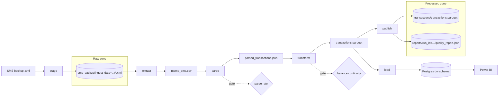

# Architecture

## Pipeline



Each step is a plain Python function in `src/orchestration/pipeline.py`. The runner calls them in
order and stops at the first failure. An Airflow DAG will call the same functions as tasks.

| Step | Module | Input → output |
|---|---|---|
| stage | `lake/raw_zone.py` | backups in `data/inbox/` → raw zone objects (already-staged ones skipped) |
| extract | `extraction/filter_sms.py` | **every** staged backup → `momo_sms.csv` |
| parse | `extraction/momo_parser.py` | CSV → `parsed_transactions.json` + `unparsed_sms.csv` |
| transform | `transform/run.py` | parsed JSON → categorised `transactions.parquet` + `quality_report.json` |
| publish | `orchestration/pipeline.py` | Parquet + report → processed zone |
| load | `load/warehouse.py` | pending schema migrations, then Parquet → `dw.fact_transaction` and dimensions |

## Steps in detail

### Stage
Copies a backup into the raw zone under `sms_backup/ingest_date=YYYY-MM-DD/<name>-<hash>.xml`.
The hash is of the file's content, so staging the same file again (even on another day) does
nothing, and an existing object is never overwritten.

### Extract
Streams every staged backup, oldest first, and keeps SMS from allowlisted senders
(`MOMO_SENDERS` in `utils/constants.py`). Each SMS gets a stable `message_id`, a hash of
sender, timestamp and text, so the same SMS has the same ID in every backup. A message that
appears in several backups is kept once and credited to the first backup that had it
(`source_object`).

### Parse
Matches each SMS against a table of templates (`TEMPLATES` in `utils/constants.py`), one per
provider message format, and extracts amount, direction, counterparty, balance, fee, tax,
reference and transaction ID. Every message gets one of three statuses:

| Status | Meaning | Where it goes |
|---|---|---|
| `parsed` | Template matched and the amount was found | `parsed_transactions.json` |
| `ignored` | Not a transaction: OTP, failed payment, promo, customer notice | dropped, counted in the stats |
| `unparsed` | Unknown format, or a required field missing | `unparsed_sms.csv` for review |

A message that mentions a balance is never ignored as a promo, so a real transaction in a new
format stays visible as `unparsed` instead of disappearing.

Template-per-format parsing beats a generic model here: provider formats are few and stable,
and a template is auditable.

### Transform
Runs these steps in order (`transform/run.py`):

1. **Clean**: cast types, set missing fee/tax to 0, reject invalid rows loudly.
2. **Deduplicate**: MTN often sends two SMS for one transaction with the same transaction ID.
   The copy with the most information wins (a real counterparty name beats `Merchant 223691`),
   gaps are filled from the other copy, and ties are broken by `message_id`.
3. **Drop cross-provider receipts**: a purchase paid from one wallet can be confirmed by
   another provider within seconds. The confirmation has no balance, so it's dropped.
4. **Normalise counterparties**: clean names, split out phone numbers, classify each as
   person, merchant, telco, agent, bank, own wallet or provider.
5. **Enrich**: natural key, signed amount, total cost, date and hour keys, internal-transfer flag.
6. **Categorise**: give every transaction a category and record the rule that chose it
   (see [Categorisation](#categorisation)).
7. **Flag recurring payments**: mark repeat payments and group them into series
   (see [Recurring payments](#recurring-payments)).
8. **Check balance continuity**: each reported balance should equal the previous balance plus
   every flow since. A gap usually means an SMS is missing from the backup; each gap is flagged
   and labelled (see [Runbook](runbook.md#balance-gaps)).
9. **Write**: validate against the schema in `transform/schema.py`, then write Parquet.

### Categorisation
`transform/categorise.py` applies rules in order; the first match wins, and the rule is
stored in `category_rule` so every category can be explained:

| Order | Rule | Example → category | `category_rule` |
|---|---|---|---|
| 1 | Own money | savings move → Savings; transfer to your other wallet → Own Transfers | `own:savings`, `own:transfer` |
| 2 | Money in, by type | cash-in → Cash Deposit; interest → Income; refund → Refunds | `money_in:cashin` |
| 3 | Debit type | airtime → Airtime/Data; cash-out → Cash Withdrawal | `type:airtime` |
| 4 | Reference purpose | "food", "friedrice" → Food; "tithesandoffering" → Giving | `reference:food` |
| 5 | Counterparty name | "… PHARMACY LIMITED" → Health; "OTHER NETWORKS" → Airtime/Data | `counterparty:pharmacy` |
| 6 | Default by kind | person → Transfers-Personal; merchant → Transfers-Business | `default:person` |
| 7 | Nothing matched | → Uncategorized, logged by message ID | `none` |

For references like "Name,233200000000,food", only the last part (the purpose) is used.
The rules are data (keyword patterns), so better coverage means adding a keyword. Coverage
(share of your own spending with a category) is in every run report and gated at 90%.
Rule-based on purpose: it's auditable, and there's far too little labelled data for a model.

### Recurring payments
`transform/recurring.py` finds repeat payments in your own spending. A **series** is the
payments to one counterparty within an amount band (±10%). It's recurring when the gaps
between its payment days fit one rhythm:

| Rhythm | A gap fits if it's | `recurring_interval_days` |
|---|---|---|
| daily | 1–2 days | 1 |
| weekly | 5–9 days | 7 |
| fortnightly | 12–17 days | 14 |
| monthly | 26–35 days | 30 |

A series needs at least 4 payment days, and at least 60% of its gaps (and at least 3) must
fit, so a couple of coincidences don't make a pattern. Several payments on one day count
once. Each payment in a series gets `is_recurring`, `recurring_interval_days` and a stable
`recurring_series` ID. A series is **active** if its last payment is within two rhythm-lengths
of the latest data; the run report lists every series (without counterparty names) and the
monthly cost of the active ones.

On the current data this finds 7 series: six daily airtime/bundle habits and a monthly
Giving payment. Cash withdrawals are frequent but irregular, so they're correctly not flagged.

### Load
Applies pending schema migrations (`sql/migrations/`, tracked in `dw.schema_migration`),
then upserts dimensions and facts into the Postgres `dw` schema in one database transaction.
See [Data model](data-model.md) for the tables.

## Idempotency

Running the pipeline any number of times on the same inputs gives identical output, and new
backups only ever add history.

| Guarantee | How |
|---|---|
| Same input, same output | Stable IDs, deterministic sort orders, full rebuild from the raw zone (tested byte-for-byte) |
| New backups add, never replace | Extract reads every staged backup and deduplicates on `message_id` |
| No half-written files | Every output is written to a temp file and swapped in (`utils/fileio.py`) |
| No duplicate staging | Raw-zone keys include a content hash |
| Re-loading changes nothing | Upserts on natural keys; a fact row is only updated when its data changed |
| Failed load leaves no trace | One database transaction per load; failures are rolled back and recorded in `dw.etl_run` |

## Quality gates

`orchestration/gates.py` fails the run, before anything is published, when:

| Gate | Default | Checked after |
|---|---|---|
| Parse rate below | 95% | parse |
| No transactions parsed | | parse |
| Balance continuity below (per provider) | 98% | transform |
| Unexplained balance gaps above | 20 | transform |

Limits are set in `.env` (`GATE_*`). A failure lists every broken limit at once.

## Lineage and auditing

- Every transaction records the raw-zone backup it came from (`source_object`).
- Every run has an ID like `20261005T153247Z-14c523`, written to its quality report.
- Each run's report is kept in the processed zone under `reports/run_id=<id>/`, so metrics
  like parse rate and continuity keep their history.
- In the warehouse, each fact row records the run that last inserted or changed it
  (`pipeline_run_id`), and `dw.etl_run` records every load with its counts and report.

## Storage

The lake is two buckets on **RustFS**, an S3-compatible server in the Docker stack:
`sikatrack-raw` (every backup, versioned) and `sikatrack-processed` (the latest dataset plus a
report per run). `lake/init_buckets.py` creates them on startup. `lake/store.py` wraps the S3
client in a small interface; tests run it against `moto`, an in-memory S3.

The Docker stack uses **RustFS** rather than MinIO: MinIO stopped publishing community
Docker images in 2025, and RustFS is an S3-compatible drop-in with the same ports and a web
console. Any S3-compatible server works, since the pipeline only uses the standard S3 API.

## Personal data

This pipeline handles real financial data about real people.

- `data/`, `logs/` and `.env` are gitignored.
- Logs contain message IDs, never SMS text. Unparsed messages are in `unparsed_sms.csv`.
- Run reports store owner settings only as counts and a fingerprint.
- Power BI reads `dw.v_fact_transaction`, which leaves out `raw_text`.
- Test fixtures use the real formats with made-up names and numbers.

## Design decisions

| Decision | Why |
|---|---|
| pandas, not Spark | About 2,000 transactions a year; Spark would add a JVM and a cluster for nothing |
| Full rebuild each run | Small data, simple logic, and window-style checks (balance continuity) need the whole history anyway |
| Templates, not ML, for parsing | Provider formats are few and stable; templates are exact and auditable |
| Raw zone as source of truth | Any later layer can be rebuilt; a parser fix applies to all past data on the next run |
| Fail loudly on bad data | A gate failure means a new SMS format or missing data, which needs a human, not a silent fix |
| Airflow as orchestrator | Retries, scheduling and visibility once the pipeline runs unattended (Docker) |

## Orchestration (Airflow)

`dags/sikatrack_pipeline.py` runs the same step functions as the command-line runner, one
Airflow task each:

```
start → stage → has_changes → extract → parse → transform → publish → load → remember → cleanup
```

| Practice | How |
|---|---|
| Thin DAG | Tasks only call functions in `src/`; all logic is testable without Airflow |
| Small XCom | Tasks pass a run ID and small stats; data stays in files and the lake |
| Deterministic run ID | Derived from the Airflow run ID, so a retried run reuses its `etl_run` row and lake keys |
| Isolated work files | Each run works in `data/work/<run_id>/`, deleted after success, kept after a failure |
| Targeted retries | Storage and database tasks retry 2× with exponential backoff; quality-gate tasks fail at once |
| Skip unchanged runs | `has_changes` compares a fingerprint of the staged backups and owner settings with the last processed run; `force=true` overrides it |
| No overlap or backfill | `max_active_runs=1`, `catchup=False`: every run rebuilds from all backups anyway |
| Assets | `publish` and `load` declare the Parquet dataset and the fact table as outputs, so downstream DAGs can be triggered by new data |
| Fast parsing | Heavy imports happen inside tasks, not at the top of the DAG file |

## Monitoring and alerting

`src/monitoring/` holds plain functions, tested without Airflow or a mail server:

| Module | Job |
|---|---|
| `notify.py` | Send email over SMTP (Gmail by default), settings from `.env` |
| `callbacks.py` | Airflow `on_failure_callback` on every task of both DAGs: task, run, error, log link |
| `checks.py` | Staleness, failure and quality-drift checks, each returning critical / warning findings |
| `daily.py` | The `sikatrack_monitoring` DAG's task: gather state, run checks, email the digest |
| `watchdog.py` | Runs on Windows (Task Scheduler) to catch the stack itself being down |

Each pipeline run writes a **heartbeat** (`state/pipeline_heartbeat.txt` in the processed bucket)
in its `stage` task, even when it then skips, so monitoring can tell a quiet day from a stopped
pipeline. Each run report now also carries the parse numbers, so the digest and the drift
checks can see the parse rate. See the [Runbook](runbook.md#monitoring-and-alerts) for setup,
limits and how to silence alerts.

## What's next

1. The Power BI dashboard on `dw.v_fact_transaction`.
