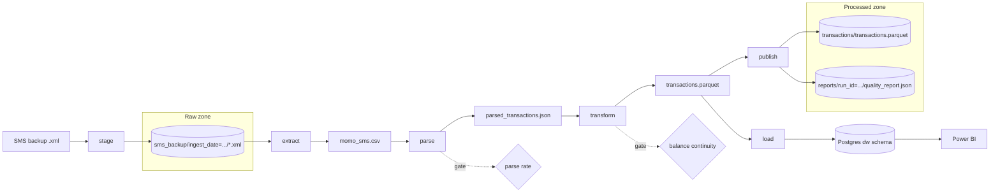

# Architecture

## Pipeline

Each step is a plain Python function in `src/orchestration/pipeline.py`. The runner calls them in
order and stops at the first failure. An Airflow DAG will call the same functions as tasks.

| Step | Module | Input → output |
|---|---|---|
| stage | `lake/raw_zone.py` | backup file → raw zone object (skipped if already staged) |
| extract | `extraction/filter_sms.py` | **every** staged backup → `momo_sms.csv` |
| parse | `extraction/momo_parser.py` | CSV → `parsed_transactions.json` + `unparsed_sms.csv` |
| transform | `transform/run.py` | parsed JSON → `transactions.parquet` + `quality_report.json` |
| publish | `orchestration/pipeline.py` | Parquet + report → processed zone |
| load | `load/warehouse.py` | Parquet → `dw.fact_transaction` and dimensions (with `--load`) |

## Steps in detail

### Stage
Copies a backup into the raw zone under `sms_backup/ingest_date=YYYY-MM-DD/<name>-<hash>.xml`.
The hash is of the file's content, so staging the same file again (even on another day) does
nothing, and an existing object is never overwritten.

### Extract
Streams every staged backup, oldest first, and keeps SMS from allowlisted senders
(`MOMO_SENDERS` in `utils/constants.py`). Each SMS gets a stable `message_id`, a hash of
sender, timestamp and text, so the same SMS has the same ID in every backup. A message that
appears in several backups is kept once and credited to the first backup that had it
(`source_object`).

### Parse
Matches each SMS against a table of templates (`TEMPLATES` in `utils/constants.py`), one per
provider message format, and extracts amount, direction, counterparty, balance, fee, tax,
reference and transaction ID. Every message gets one of three statuses:

| Status | Meaning | Where it goes |
|---|---|---|
| `parsed` | Template matched and the amount was found | `parsed_transactions.json` |
| `ignored` | Not a transaction: OTP, failed payment, promo, customer notice | dropped, counted in the stats |
| `unparsed` | Unknown format, or a required field missing | `unparsed_sms.csv` for review |

A message that mentions a balance is never ignored as a promo, so a real transaction in a new
format stays visible as `unparsed` instead of disappearing.

Template-per-format parsing beats a generic model here: provider formats are few and stable,
and a template is auditable.

### Transform
Runs these steps in order (`transform/run.py`):

1. **Clean**: cast types, set missing fee/tax to 0, reject invalid rows loudly.
2. **Deduplicate**: MTN often sends two SMS for one transaction with the same transaction ID.
   The copy with the most information wins (a real counterparty name beats `Merchant 223691`),
   gaps are filled from the other copy, and ties are broken by `message_id`.
3. **Drop cross-provider receipts**: a purchase paid from one wallet can be confirmed by
   another provider within seconds. The confirmation has no balance, so it's dropped.
4. **Normalise counterparties**: clean names, split out phone numbers, classify each as
   person, merchant, telco, agent, bank, own wallet or provider.
5. **Enrich**: natural key, signed amount, total cost, date and hour keys, internal-transfer flag.
6. **Check balance continuity**: each reported balance should equal the previous balance plus
   every flow since. A gap usually means an SMS is missing from the backup; each gap is flagged
   and labelled (see [Runbook](runbook.md#balance-gaps)).
7. **Write**: validate against the schema in `transform/schema.py`, then write Parquet.

### Load
Upserts dimensions and facts into the Postgres `dw` schema in one database transaction. See
[Data model](data-model.md) for the tables.

## Idempotency

Running the pipeline any number of times on the same inputs gives identical output, and new
backups only ever add history.

| Guarantee | How |
|---|---|
| Same input, same output | Stable IDs, deterministic sort orders, full rebuild from the raw zone (tested byte-for-byte) |
| New backups add, never replace | Extract reads every staged backup and deduplicates on `message_id` |
| No half-written files | Every output is written to a temp file and swapped in (`utils/fileio.py`) |
| No duplicate staging | Raw-zone keys include a content hash |
| Re-loading changes nothing | Upserts on natural keys; a fact row is only updated when its data changed |
| Failed load leaves no trace | One database transaction per load; failures are rolled back and recorded in `dw.etl_run` |

## Quality gates

`orchestration/gates.py` fails the run, before anything is published, when:

| Gate | Default | Checked after |
|---|---|---|
| Parse rate below | 95% | parse |
| No transactions parsed | | parse |
| Balance continuity below (per provider) | 98% | transform |
| Unexplained balance gaps above | 20 | transform |

Limits are set in `.env` (`GATE_*`). A failure lists every broken limit at once.

## Lineage and auditing

- Every transaction records the raw-zone backup it came from (`source_object`).
- Every run has an ID like `20261005T153247Z-14c523`, written to its quality report.
- Each run's report is kept in the processed zone under `reports/run_id=<id>/`, so metrics
  like parse rate and continuity keep their history.
- In the warehouse, each fact row records the run that last inserted or changed it
  (`pipeline_run_id`), and `dw.etl_run` records every load with its counts and report.

## Storage backends

`lake/store.py` has one small interface with two backends, chosen by `LAKE_BACKEND`:

| Backend | Where buckets live | Used for |
|---|---|---|
| `local` | Folders under `data/lake/` | Development without Docker (current) |
| `s3` | Buckets on the S3 server at `S3_ENDPOINT` (RustFS) | Docker / production |

Both are covered by the same tests; the S3 backend is tested with `moto`, which simulates the
S3 API that RustFS implements.

The Docker stack uses **RustFS** rather than MinIO: MinIO stopped publishing community
Docker images in 2025, and RustFS is an S3-compatible drop-in with the same ports and a web
console. Any S3-compatible server works, since the pipeline only uses the standard S3 API.

## Personal data

This pipeline handles real financial data about real people.

- `data/`, `logs/` and `.env` are gitignored.
- Logs contain message IDs, never SMS text. Unparsed messages are in `unparsed_sms.csv`.
- Run reports store owner settings only as counts and a fingerprint.
- Power BI reads `dw.v_fact_transaction`, which leaves out `raw_text`.
- Test fixtures use the real formats with made-up names and numbers.

## Design decisions

| Decision | Why |
|---|---|
| pandas, not Spark | About 2,000 transactions a year; Spark would add a JVM and a cluster for nothing |
| Full rebuild each run | Small data, simple logic, and window-style checks (balance continuity) need the whole history anyway |
| Templates, not ML, for parsing | Provider formats are few and stable; templates are exact and auditable |
| Raw zone as source of truth | Any later layer can be rebuilt; a parser fix applies to all past data on the next run |
| Fail loudly on bad data | A gate failure means a new SMS format or missing data, which needs a human, not a silent fix |
| Airflow as orchestrator | Retries, scheduling and visibility once the pipeline runs unattended (Docker) |

## What's next

1. Run RustFS, Postgres and Airflow from `docker-compose.yml`.
2. Write the Airflow DAG: one task per pipeline step.
3. Run the load step for real and build the Power BI dashboard on `dw.v_fact_transaction`.
4. Categorisation and recurring-charge detection, writing `category_key` and `is_recurring`.
