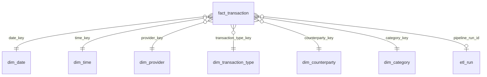

# Data Model

## Processed dataset

`transactions.parquet`: one row per real transaction. The contract lives in
`src/transform/schema.py` and is checked on every write.

| Column | Type | Null | Meaning |
|---|---|---|---|
| `transaction_nk` | string | no | Natural key: `provider:transaction_id`, or `provider:msg:<message_id>` when the SMS has no ID |
| `message_id` | string | no | ID of the SMS kept after deduplication |
| `transaction_id` | string | yes | Provider's transaction ID |
| `provider` | string | no | `mtn_momo`, `ghanapay` |
| `template` | string | no | Parser template that matched, e.g. `payment_sent`, `cash_out` |
| `transaction_type` | string | no | `transfer`, `airtime`, `cashout`, `cashin`, `merchant`, `bank_transfer`, `savings`, `interest`, `refund`, `reversal`, `other` |
| `direction` | string | no | `credit` (money in) or `debit` (money out) |
| `occurred_at` | timestamp (UTC) | no | When the SMS arrived. Ghana is UTC+0, so this is local time |
| `date_key` | int32 | no | `YYYYMMDD`, joins `dim_date` |
| `hour` | int16 | no | 0–23, joins `dim_time` |
| `amount` | float | no | GHS, always positive |
| `signed_amount` | float | no | `+amount` for credits, `-amount` for debits |
| `fee`, `tax`, `total_cost` | float | no | GHS; `total_cost = fee + tax` |
| `balance_after` | float | yes | Wallet balance after the transaction, when the SMS reports it |
| `counterparty` | string | yes | Normalised name (upper case, phone removed) |
| `counterparty_phone` | string | yes | Phone number found in the name, local format |
| `counterparty_kind` | string | no | `person`, `merchant`, `telco`, `agent`, `bank`, `own_wallet`, `provider`, `unknown` |
| `counterparty_raw` | string | yes | Name exactly as it appeared in the SMS |
| `reference` | string | yes | Reference or message entered by the sender |
| `category` | string | no | Spending/income category, e.g. Food, Airtime/Data, Income ([rules](architecture.md#categorisation)) |
| `category_rule` | string | no | Rule that chose the category, e.g. `reference:food`, `type:airtime`, `default:person` |
| `is_internal_transfer` | bool | no | Money moved between your own wallets; exclude from income and spending |
| `is_recurring` | bool | no | Part of a recurring series ([rules](architecture.md#recurring-payments)) |
| `recurring_interval_days` | int16 | yes | The series' rhythm: 1, 7, 14 or 30 |
| `recurring_series` | string | yes | Stable ID of the series; groups its payments |
| `has_balance_gap` | bool | no | The reported balance doesn't match the expected one |
| `balance_gap_amount` | float | yes | Size of the gap; null when the row couldn't be checked |
| `balance_gap_reason` | string | yes | `own_transfer_leg_missing` or `unexplained` |
| `sms_count` | int16 | no | How many SMS reported this transaction |
| `raw_text` | string | no | Original SMS text |
| `source_object` | string | yes | Raw-zone backup the SMS first came from |

## Warehouse: star schema

Defined by the migrations in `sql/migrations/`, schema `dw`. The grain of `fact_transaction` is one real
transaction.

| Table | Natural key | Holds |
|---|---|---|
| `fact_transaction` | `transaction_nk` | Measures, flags, data-quality columns, lineage |
| `dim_date` | `date_key` | Every day 2020–2030: weekday, ISO week, month, quarter, year, weekend and month-end flags |
| `dim_time` | `time_key` | Hours 0–23 with a day part (Morning, Afternoon, Evening, Night) |
| `dim_provider` | `provider_code` | Mobile-money providers |
| `dim_transaction_type` | `(template, transaction_type)` | Template, type, direction, "Money In"/"Money Out" label |
| `dim_counterparty` | `counterparty_name` | Phone, kind, first and last seen |
| `dim_category` | `category_name` | Categories, each in a `category_group`: Spending, Money In, Own Money or Unknown |
| `etl_run` | `run_id` | One row per load: status, row counts, quality report, error |

Every dimension has an **Unknown** member with key `-1`, so fact rows never have null foreign
keys.

### How the load stays idempotent

- Dimensions are upserted on their natural keys.
- Facts are upserted on `transaction_nk`. A row is only updated when one of its data columns
  changed; then `pipeline_run_id` and `updated_at` record the change.
- A category the transform uses but `dim_category` lacks fails the load; add it in a migration.
- The whole load is one database transaction. A failure rolls everything back and is recorded
  in `etl_run` with status `failed` and the error.

## Power BI notes

- Connect to the view `dw.v_fact_transaction`, not the table. It has the same data without
  the raw SMS text.
- Mark `dim_date` as the date table.
- Filter `is_internal_transfer = false` for income and spending, otherwise money moved between
  your own wallets is counted twice. (Those rows are also in the **Own Money** category group.)
- Use `dim_category.category_group` to split Spending from Money In.
- `balance_after` is a point-in-time value: show the last value in a period
  (e.g. `LASTNONBLANK`), never a sum.
- Use `signed_amount` for net cash flow and `amount` with `flow_label` for in/out breakdowns.

### Schema migrations

Schema changes are numbered SQL files in `sql/migrations/`. The load step applies any the
database hasn't seen yet, in order, each in its own transaction, and records them in
`dw.schema_migration`:

| Migration | Adds |
|---|---|
| `001_star_schema` | The star schema, `etl_run`, and the Power BI view |
| `002_categorisation` | Categories and their groups, `fact_transaction.category_rule`, the column in the view |
| `003_recurring` | `fact_transaction.recurring_series` and its index, the column in the view |

To change the schema, add the next file (`003_….sql`); never edit one that has run. A
database created before migrations were tracked is recognised and only gets the newer files.
